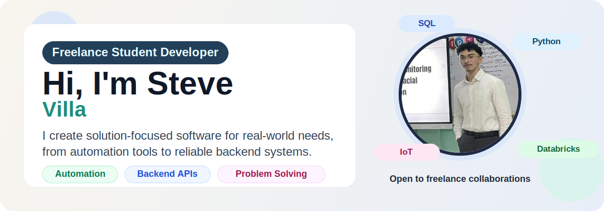

  

<h3 align="center">Freelance Student Developer</h3>

  I design and build technology solutions that solve concrete problems. My core hobby is problem-solving through coding, especially by automating repetitive workflows and improving system reliability.

  

  

## Current Focus

- I am currently building solution-based projects for automation, monitoring, and backend reliability.
- I am strengthening my data engineering path with `SQL`, `Python`, `Apache Spark`, and `Databricks`.
- Ask me about `UNIX`, `SQL`, `Python`, `PostgreSQL`, and `IoT Systems`.
- Portfolio: `https://steve-villa-portfolio.netlify.app/`
- Location: `Quezon City`
- Fun fact: `I am a university athlete and I enjoy building tools that save time.`

---

## My Skills

  

---

## Connect with Me

  
  
  
  

---

## Publications

I am interested in applied research and engineering experimentation, especially around AI-enabled and embedded solution systems. I continue documenting research-oriented work and project implementations with practical outcomes.

If you want details about my research, thesis work, or technical writeups, feel free to ask.

---

## GitHub Stats

  
  

  

---
