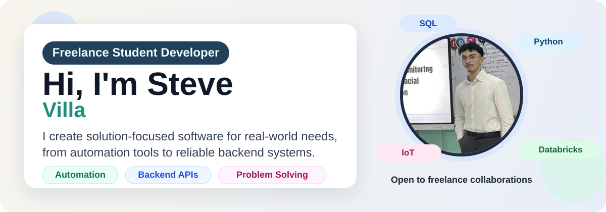

  

<h3 align="center">Freelance Student Developer | Data Engineering & Automation</h3>

  
  
  

  I design and build technology solutions that solve concrete problems. My core hobby is problem-solving through coding, especially by automating repetitive workflows and improving system reliability.

  

---

## What I Do

<table>
  <tr>
    <td width="50%" valign="top">
      <h4>🔧 Automation & Reliability</h4>
      
Building tools that save time and improve system uptime. From workflow automation to monitoring dashboards.

    </td>
    <td width="50%" valign="top">
      <h4>📊 Data Engineering</h4>
      
Working with SQL, Python, Apache Spark, and Databricks to process and analyze data at scale.

    </td>
  </tr>
  <tr>
    <td width="50%" valign="top">
      <h4>🌐 Backend Development</h4>
      
Building REST APIs and microservices with Python/Flask and Node.js.

    </td>
    <td width="50%" valign="top">
      <h4>🔌 IoT & Embedded Systems</h4>
      
Arduino projects and system-level programming for hardware integration.

    </td>
  </tr>
</table>

---

## Tech Stack

### Languages

  

### Frameworks & Tools

  

### Data & Infrastructure

  

> **Core Stack:** Python · SQL · PostgreSQL · Flask · Linux · Git
> **Data Engineering:** Apache Spark · Databricks · Apache Airflow
> **Also comfortable with:** Java · JavaScript · TypeScript · C++ · Arduino

---

## Featured Projects

<table>
  <tr>
    <td width="50%" valign="top">
      <h4><a href="https://github.com/kaizen-2004/capstone-repository">CondoGuardian — Real-Time Intruder & Fire Monitoring</a></h4>
      
IoT-based security system with ESP32-C3 sensors, RTSP night-vision cameras, face recognition (InsightFace), fire detection CNN, FastAPI backend, and React dashboard. Includes PWA mobile access and Telegram alerts.

      

        <code>Python</code> <code>TypeScript</code> <code>C++</code> <code>Dart</code> <code>FastAPI</code> <code>React</code>
      

    </td>
    <td width="50%" valign="top">
      <h4><a href="https://github.com/kaizen-2004/IoT-Energy-Monitoring-and-Analysis">IoT Energy Monitoring & Analysis</a></h4>
      
Non-invasive ESP32-based power monitoring system using SCT-013 current sensors. Computes real-time power consumption, sends data to cloud backend, and visualizes historical usage on a React dashboard.

      

        <code>TypeScript</code> <code>JavaScript</code> <code>C++</code> <code>Node.js</code> <code>PostgreSQL</code>
      

    </td>
  </tr>
  <tr>
    <td width="50%" valign="top">
      <h4><a href="https://github.com/kaizen-2004/IoT-Nutrient-Regulation-System-for-Urban-Farming">IoT Nutrient Regulation for Urban Farming</a></h4>
      
Solar-powered automated irrigation and nutrient dosing system. ESP32-C3 controller + Arduino Uno sensor bridge, soil/NPK monitoring, 4-channel relay pump control, LCD display, and Flutter provisioning app.

      

        <code>C++</code> <code>Dart</code> <code>Arduino</code> <code>Flutter</code> <code>Modbus</code>
      

    </td>
    <td width="50%" valign="top">
      <h4><a href="https://github.com/kaizen-2004/Barangay-Document-Management-System-V2">Barangay Document Management System</a></h4>
      
Flask-based local government system for resident records, barangay clearance issuance, reporting, audit logging, and backups. Generates .docx/PDF documents via LibreOffice conversion.

      

        <code>Python</code> <code>Flask</code> <code>MySQL</code> <code>Bootstrap</code> <code>HTML</code>
      

    </td>
  </tr>
</table>

---

## GitHub Activity

  
  

  

---

## Let's Connect

  
  
  

---

  <i>📍 Quezon City, Philippines</i> 
  <i>⚡ Ask me about UNIX, SQL, Python, PostgreSQL, and IoT Systems</i>

